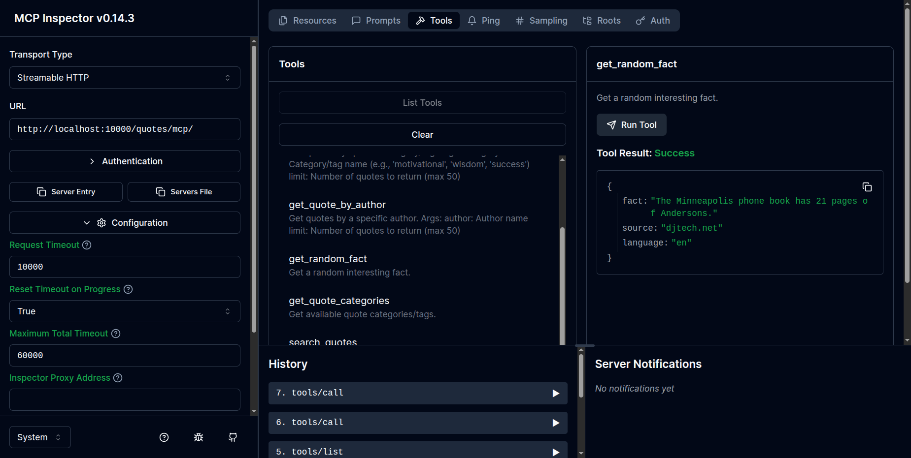
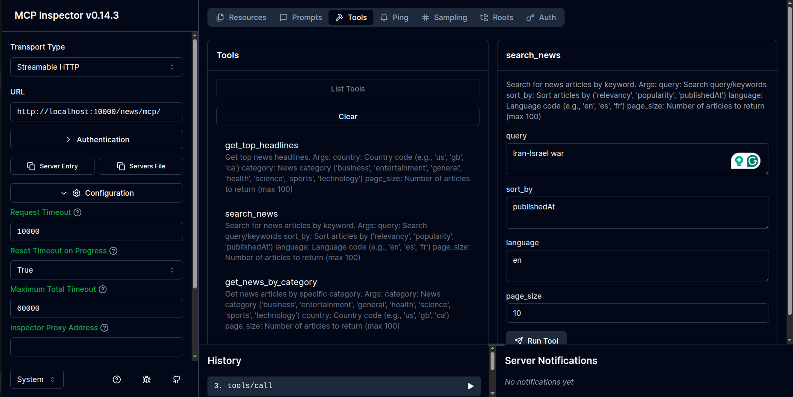
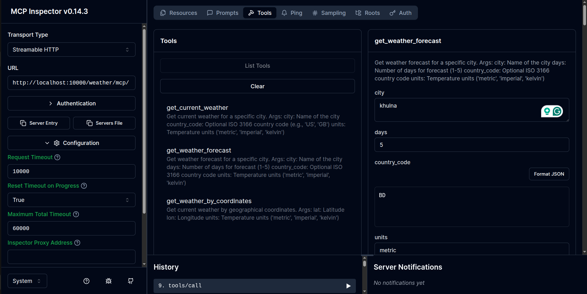
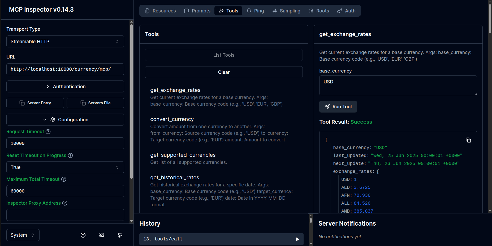

# Multi-Server MCP FastAPI Project

A comprehensive FastAPI application that hosts multiple Model Context Protocol (MCP) servers, each providing access to different public APIs and services.


## Work Demo

[fastmcp-multi-server-mcp.webm](https://github.com/user-attachments/assets/d626b52e-f52f-4102-b269-7dad10577f90)

## 🚀 Features

This project includes 5 different MCP servers:

- **Weather Server** – OpenWeatherMap API integration for weather data
- **News Server** – NewsAPI integration for latest news articles
- **Currency Server** – Exchange rates and currency conversion
- **Quote Server** – Inspirational quotes and random facts

## 📋 Prerequisites

- Python 3.13+
- [UV](https://github.com/astral-sh/uv) package manager
- API keys for external services (see Configuration section)

📁 Project Structure

```
fastapi-multi-server-mcp/
├── main.py                 # FastAPI application entry point
├── requirements.txt        # Python dependencies
├── pyproject.toml         # UV project configuration
├── .env.example           # Environment variables template
├── README.md              # This file
├── servers/               # MCP servers directory
│   ├── __init__.py
│   ├── weather_server.py  # Weather API MCP server
│   ├── news_server.py     # News API MCP server
│   ├── currency_server.py # Currency API MCP server
│   └── quote_server.py    # Quotes API MCP server
├── utils/                 # Utility modules
│   ├── __init__.py
│   ├── api_clients.py     # HTTP client utilities
│   └── config.py          # Configuration management
├── tests/                 # Test suite
│   ├── __init__.py
│   ├── test_weather.py
│   ├── test_news.py
│   ├── test_currency.py
│   └── test_quote.py
└── docs/                  # Documentation
    ├── api_reference.md
    └── deployment.md
```


## 🛠️ Installation

### Using UV (Recommended)

```bash
# Clone the repository
git clone <your-repo-url>
cd fastapi-multi-server-mcp

# Create virtual environment and install dependencies
uv venv
source .venv/bin/activate  # On Windows: .venv\Scripts\activate
uv pip install -r requirements.txt
```

### Using pip

```bash
pip install -r requirements.txt
```
## 🔧 Configuration

Create a `.env` file in the root directory with your API keys:

```env
# Weather API (OpenWeatherMap)
OPENWEATHER_API_KEY=your_openweather_api_key

# News API
NEWS_API_KEY=your_news_api_key


# Exchange Rates API
EXCHANGE_RATES_API_KEY=your_exchange_rates_api_key

# Server Configuration
PORT=10000
HOST=0.0.0.0
```

### Getting API Keys

- OpenWeatherMap: Register at [openweathermap.org](https://openweathermap.org)
- NewsAPI: Get free API key at [newsapi.org](https://newsapi.org)
- Exchange Rates: Register at [exchangerate-api.com](https://www.exchangerate-api.com)
- Quote API: Get free API key at [quotesapi.com](https://quotesapi.com)

## 🏃‍♂️ Running the Application

### Development

```bash
# Using UV
uv run uvicorn main:app --reload --host 0.0.0.0 --port 10000 --reload

# Using `npx` to debug the running application,
npx @modelcontextprotocol/inspector uv run uvicorn main:app
```

To connect specific server to inspector, 

Set, 

1. Transport Type: `StreamableHTTP`

2. URLs: 

- for news: http://localhost:10000/news/mcp/
- for weather: http://localhost:10000/weather/mcp/
- for currency: http://localhost:10000/currency/mcp/
- for quotes: http://localhost:10000/quotes/mcp/

3. Click connect.

it will open inspector window like this:

quotes server:


news server:


weather server:


currency server:



As of June 2025, Windsurf and Cursor supports two transport types for MCP servers: `stdio` and `/sse`, but not `StreamableHTTP`. So using `stdio` or `/sse` as transport type is recommended. But with inspector, you can connect to the MCP server running on FastAPI with any transport type.

### Production

```bash
# Using Gunicorn
gunicorn main:app -w 4 -k uvicorn.workers.UvicornWorker --bind 0.0.0.0:10000
```

## 📚 API Endpoints

Once running, your MCP servers will be available at:

- Weather Server: [http://localhost:10000/weather](http://localhost:10000/weather)
- News Server: [http://localhost:10000/news](http://localhost:10000/news)
- Currency Server: [http://localhost:10000/currency](http://localhost:10000/currency)
- Quote Server: [http://localhost:10000/quotes](http://localhost:10000/quotes)

## 🧪 Testing

```bash
# Run all tests
pytest

# Run with coverage
pytest --cov=.

# Run specific server tests
pytest tests/test_weather.py
```

## 🛠️ Available Tools by Server

<details>
  <summary>🖼️ Click to see the tool details</summary>

### Weather Server (/weather)

    get_current_weather - Get current weather for a city
    get_weather_forecast - Get 5-day weather forecast
    get_weather_by_coordinates - Get weather by latitude/longitude

### News Server (/news)

    get_top_headlines - Get top news headlines
    search_news - Search news articles by keyword
    get_news_by_category - Get news by category (business, tech, sports, etc.)

### Currency Server (/currency)

    get_exchange_rates - Get current exchange rates
    convert_currency - Convert between currencies
    get_supported_currencies - List all supported currencies

### Quote Server (/quotes)

    get_random_quote - Get a random inspirational quote
    get_quote_by_category - Get quotes by category
    get_random_fact - Get a random interesting fact

</details>

🚀 Deployment

### Docker

You can deploy this project using Docker. Example `Dockerfile` is included:

```dockerfile
FROM python:3.11-slim
WORKDIR /app
COPY requirements.txt .
RUN pip install -r requirements.txt
COPY . .
EXPOSE 10000
CMD ["uvicorn", "main:app", "--host", "0.0.0.0", "--port", "10000"]
```

### Environment Variables for Production

```
PORT=10000
HOST=0.0.0.0
LOG_LEVEL=info
WORKERS=4
```

📝 License

This project is licensed under the MIT License - see the LICENSE file for details.

📚 Support & Documentation

- Check the documentation in the `docs/` directory
- Review the test files for usage examples

🔄 Updates and Roadmap

- Add WebSocket support for real-time data
- Implement caching for API responses
- Add rate limiting and authentication
- Create web dashboard for monitoring
- Add more API integrations (Spotify, Twitter, etc.)